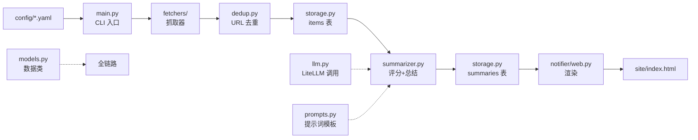

# AI4S-Daily 考核复习指南

> 面向「逐文件代码讲解」的复习提纲，覆盖架构、数据流、每个模块、数据库、配置、提示词、部署、测试与设计决策。

---

## 0. 一句话概括

AI4S-Daily 是一个「**定时抓取 → LLM 评分 → LLM 总结 → 渲染静态页**」的 **AI for Science 日报**。
全程只有 SQLite 一个持久层，最终产物是一个单文件 `index.html`，通过 GitHub Actions 定时跑、推送到 GitHub Pages。

---

## 1. 架构总览



### 目录结构

```
├── config/
│   ├── sources.yaml        # 信息源清单（rss/arxiv/github/hackernews 四种 type）
│   └── preferences.yaml    # 关键词、抓取窗口、模型、评分阈值、top_n、subfields
├── prompts/
│   ├── score.txt           # 「评分」提示词模板
│   └── summarize.txt       # 「总结」提示词模板
├── src/
│   ├── main.py             # CLI 入口：fetch / summarize / render
│   ├── config.py           # 读配置 + 校验
│   ├── models.py           # 数据模型（Item/Score/Summary/Analysis）
│   ├── dedup.py            # URL 去重
│   ├── storage.py          # SQLite 读写（Storage 类）
│   ├── summarizer.py       # 评分 + 总结流水线
│   ├── llm.py              # LiteLLM 封装
│   ├── prompts.py          # 加载/渲染提示词
│   ├── logging_setup.py    # 日志初始化
│   ├── fetchers/           # 抓取器
│   └── notifier/
│       ├── web.py          # 渲染 HTML
│       └── labels.py       # 来源 → 友好名 + 分类
├── templates/index.html.j2 # 单文件 HTML 模板（Jinja2）
├── tests/                  # pytest（92 个）
└── .github/workflows/daily.yml
```

---

## 2. 三命令流程

| 命令 | 做了什么 | 写入 | 输出 |
|------|---------|------|------|
| `python -m src.main fetch` | 抓取全部源 → 去重 → 入库 | `items` 表 | `fetched=N deduped=M stored=M` |
| `python -m src.main summarize` | 打分 → 过阈值取 top_n → 总结 | `summaries` 表 | `scored=X passed=Y summarized=Z cost=$...` |
| `python -m src.main render` | 读今日+归档 → 渲染 HTML → 标记 surfaced | `summaries.surfaced_at` | `rendered=N output=site` |

三个命令**共享参数** `--sources` / `--preferences` / `--db`；`render` 额外有 `--output-dir` / `--within-days`。

**幂等性**：三个命令都可以重复跑，不会重复入库 / 重复打分 / 重复推送。

---

## 3. 数据库（两张表）

数据库文件：`data/ai_daily.db`（SQLite 单文件）。

### items 表 —— 抓到的原始条目

| 列 | 含义 |
| --- | --- |
| `url` (主键) | 条目链接，去重依据 |
| `title` / `content` | 标题 / 正文（摘要） |
| `source` | 来源标识，形如 `rss:deepmind-blog`、`arxiv:arxiv-qbio` |
| `published_at` | 原文发布时间 |
| `raw_json` | 抓取时的原始数据（JSON 字符串） |
| `first_seen` | 本项目第一次见到该 URL 的时间 |

### summaries 表 —— 评分 + 总结结果

| 列 | 含义 |
| --- | --- |
| `url` (主键，外键→items) | 对应条目 |
| `score` | 0-10 分 |
| `tags_json` | 主题标签（JSON 字符串） |
| `field` | **Phase 1 新增** AI4S 子领域 key |
| `scorer_model` / `scorer_cost_usd` | 打分模型 / 成本 |
| `innovation` / `approach` / `metrics` / `links` / `why_relevant` | 总结的 5 个结构化字段（可空） |
| `summarizer_model` / `summarizer_cost_usd` | 总结模型 / 成本 |
| `created_at` | 打分时间 |
| `surfaced_at` | **首次"上墙"时间**（区分今日/归档，可空） |
| `summarized_at` | **写摘要时间**（每日 `top_n` 额度用，可空） |

### surfaced_at 的巧思（按日期分今日/归档）

- `surfaced_at IS NULL` 或 `surfaced_at >= 今天零点` → 「今日新增」栏
- `render` 完成后 `mark_surfaced()` 把还没上墙的条目 `surfaced_at` 置为当前时间
- **同一天多次 render**，「今日新增」仍然保留（因为上墙日期还是今天）
- 跨天后，这些条目的 `surfaced_at < 今天零点` → 自动进「归档」
- 归档栏按 `surfaced_at` 日期分组、倒序展示

> ⚠️ **「今天零点」是 UTC 零点，不是北京时间零点，也不是"距上次 render 24 小时"。**
> 代码：`datetime.now(timezone.utc).replace(hour=0, minute=0, second=0, microsecond=0)`。
> UTC 零点 = 北京时间早上 8 点，所以"今日/归档"的分界线在北京时间 8:00（不是午夜 0:00）。
> 例：北京时间 07:00 render 仍算"昨天"，09:00 render 才跨入"今天"。
> 若希望按北京时间零点切分，改用 `ZoneInfo("Asia/Shanghai")` 或给 UTC 加 8 小时再取零点。

### 迁移（Migration）

数据库升级时给旧库补列，两个迁移函数套路相同：

```python
def _migrate_add_surfaced_at(self):  # 旧库缺 surfaced_at 列
    cols = ...  # PRAGMA table_info(summaries) 读现有列
    if "surfaced_at" not in col_names:
        ALTER TABLE summaries ADD COLUMN surfaced_at TEXT;
        UPDATE summaries SET surfaced_at = created_at;  # 老数据视为"已推送"
```

- `_migrate_add_surfaced_at()`：回填成 `created_at`，老数据不再被当成"新条目"
- `_migrate_add_field()`：Phase 1 新增，旧库补 `field` 列（默认 `''`）
- `_migrate_add_summarized_at()`：旧库补 `summarized_at` 列；已有摘要回填成 `COALESCE(surfaced_at, created_at)`（视为"过去"），不计入今天额度

---

## 4. 逐模块详解

### 4.1 `main.py` — CLI 入口（薄编排层）

`main.py` 自己不做业务，只负责把命令行、配置、环境、模块函数串起来，共 6 项职责：

1. **参数解析 `_parse_args()`**：argparse 三个子命令 fetch/summarize/render，共享 `--sources/--preferences/--db`；render 额外 `--output-dir/--within-days`。
2. **环境初始化 `main()`**：`load_dotenv()` 读 `.env`（本地方便，Actions 里 no-op）+ `setup_logging()`。
3. **三个 run_* 编排函数**：
   - `run_fetch()`：`load_config` → `fetch_all` → `dedup_by_url` → `record_items`。
   - `run_summarize_cmd()`：`load_config` → `run_summarize(storage, config)`。
   - `run_render_cmd()`：`load_config` → `render_site(...)`。
4. **把配置翻译成函数参数**：如 `min_score=config.score_threshold`、`subfields=config.subfields`（Phase 2）；`top_n=10_000` 表示"全都要"，真正过滤靠 threshold / within_days。
5. **连接生命周期**：每个 run_* 都是 `Storage(db).init()` → `try:` 业务 → `finally: storage.close()`。
6. **异步调度 + 退出码**：`asyncio.run()` 包 async 函数；成功 `return 0`，未知命令 `raise SystemExit`。

**关键设计点**：

- `main(argv: list[str] | None = None)`：为了**可测试性**——测试直接传列表（如 `main(["fetch"])`），不用改 `sys.argv`；生产用 `sys.argv[1:]`。
- 每个 run_* 默认参数是相对路径（`config/sources.yaml` 等），方便本地直接调用；GitHub Actions / 测试通过显式传参覆盖。
- 底部 `if __name__ == "__main__": sys.exit(main())`：让文件**既可被 import、又可被 `python -m src.main` 运行**（模块方式运行时 `__name__ == "__main__"` 才触发入口）。

### 4.2 `config.py` — 配置加载与校验

- `Config` / `Models` dataclass：强类型容器（`subfields` 是 Phase 1 新增）。
- `load_config()`：读两个 YAML 并组装 `Config`。
- `_parse_bounded_int()`：整数限制范围（如 `score_threshold` 0-10、`top_n` 1-100），**并排除 bool**（`True` 是 `1` 的子类）。
- `_parse_models()`：`models.scorer/summarizer` 必须是 `"provider/name"` 格式。
- `_parse_subfields()`：Phase 1 新增，解析 `subfields: [{key, label}]`，key 非空且不重复。

### 4.3 `models.py` — 数据类

- `Item`：原始条目（url/title/content/published_at/source/raw）。
- `Score`：评分结果（score/tags/model/cost_usd/**field**）。
- `Summary`：总结结果（innovation/approach/metrics/links/why_relevant）。
- `Analysis`：`Item + Score + Summary` 的**联表视图**，供渲染用。
  - `summary` 是 `Summary | None`（打了分但没写摘要时是 None）。
  - `total_cost_usd` 是计算属性（score 成本 + summary 成本）。

### 4.4 `llm.py` — LiteLLM 封装

- `_PROVIDER_ENV`：provider 前缀 → 环境变量映射（含 deepseek/openai/anthropic/gemini 等）。
- `check_api_keys()`：按模型字符串前缀反查环境变量，缺 key 提前报错。
- `parse_json_loose()`：容错解析——正则去掉 ``` ``` ``` ``` 代码围栏、修复尾逗号，再 `json.loads`。
- `complete_json()`：调 LLM，返回 `(解析后的 dict, 累计成本)`；坏 JSON 自动重试一次（重试时追加「只输出 JSON」提示），两次都失败抛 `LLMError`。
- 成本从 `response._hidden_params["response_cost"]` 读取（litellm 的价格表）。

### 4.5 `prompts.py` — 提示词模板

- `load_prompt(name)`：从 `prompts/<name>.txt` 读模板。
- `render(template, values)`：`str.format` 填充占位符。
- **考点**：JSON 示例里的 `{` 要写成 `{{` 转义（`test_prompts.py` 测了这点）。

### 4.6 `summarizer.py` — ② 阶段流水线

`run_summarize()` 主流程：

1. `purge_stale_unsummarized(older_than_days=7)`：删掉「已打分、没摘要、且超过 7 天」的陈旧分数行，避免旧候选久留后突然上墙
2. `get_unscored_items(within_days=7)` 取 7 天内未打分条目
3. `asyncio.gather` 并发 `_score_one` 打分，`save_score`；只统计 `passed_threshold`（本轮过阈值条数），**不维护内存候选列表**
4. 打分之后一条 SQL `get_scored_unsummarized(min_score, within_days=7)` 拿走**全部候选**：本轮的 + 上一轮遗留的（都有分、没摘要）——DB 每 url 一行天然去重，无需区分新旧
5. `backlog = 候选总数 - passed_threshold`（即上一轮遗留的补总结数）
6. **每日额度**：`already_today = count_summarized_since(今天零点)`，`budget = max(0, top_n - already_today)`，只取前 `budget` 条——同一天无论跑几次 summarize，当天新写摘要最多 `top_n` 条
7. `asyncio.gather` 并发 `_summarize_one` 总结，`save_summary`（写入 `summarized_at`）

- `_score_one()`：Phase 1 新增 field 校验——`field` 必须在 `cfg.subfields` 的 key 里，越界回退 `""`。
- `_summarize_one()`：校验总结 JSON 必填 5 个字段。
- 单条打分/总结失败**不中断整体**（各自 try/except）。
- metrics 额外统计 `backlog`（上一轮遗留的补总结数）、`purged`（清理掉的陈旧分数行数）、`already_today`（今天已写的摘要数，额度计算用）。

### 4.7 `storage.py` — SQLite 读写（Storage 类）

- `init()`：建库 + 迁移（`_migrate_add_surfaced_at`、`_migrate_add_field`、`_migrate_add_summarized_at`）。
- items 相关：`seen_urls` / `record_items` / `get_items_by_urls` / `get_unscored_items`。
- summaries 相关：`save_score`（UPSERT）/ `save_summary`（UPDATE）。
- 查询：`get_top_summaries` / `get_today_summaries`（今日上墙或未上墙）/ `get_archive_summaries`（之前几天上墙，按日期窗口）。
- `get_scored_unsummarized(min_score, within_days)`：`JOIN summaries` 找「分数过阈值、`innovation IS NULL`（没写摘要）、且近期」的条目，返回 `(Item, Score)` 列表——用于补总结。
- `purge_stale_unsummarized(older_than_days)`：`DELETE FROM summaries WHERE innovation IS NULL AND created_at < cutoff`，清理过期的「只打分没总结」分数行，返回删除行数。
- `count_summarized_since(cutoff)`：数 `summarized_at >= cutoff` 的摘要数，用于 enforce 每日 `top_n` 额度。
- `mark_surfaced()`：把今日条目标记为已上墙（NULL → 当前时间）。
- `_row_to_item` / `_row_to_analysis`：sqlite 行 → 数据类。

**关键 SQL 细节**：

- `INSERT OR IGNORE`（items 入库）：主键冲突就跳过，保留旧数据。
- `ON CONFLICT(url) DO UPDATE`（save_score）：冲突就覆盖，重打分不新增行。
- `LEFT JOIN ... WHERE s.url IS NULL`（get_unscored_items）：找出"有文章、没打分"的条目。
- `PRAGMA foreign_keys = ON`：开启外键约束，summaries 必须引用存在的 items。

### 4.8 `dedup.py` — URL 去重

双重过滤：`seen_urls` 查库（已存在的丢）+ 批内去重（同批重复只留第一个），保留原始顺序。

### 4.9 `fetchers/` — 抓取器

**`__init__.py`**：
- `_REGISTRY`：`{"rss": "fetch_rss", "arxiv": "fetch_arxiv", "github": "fetch_github", "hackernews": "fetch_hackernews"}`。
- `fetch_all()` / `_run_one()`：并发跑所有源，**单源失败被吞掉**（打日志返回空列表，不影响其它源）——核心设计。
- 用 `getattr(sys.modules[__name__], fetcher_name)` 动态查找，方便 monkeypatch。

**`arxiv.py`**：查 arXiv API，`sortBy=submittedDate` 取最新，`_is_transient`（超时/429/5xx）重试一次，404 不重试；**全局速率限制 `_throttle()`**（4 个 arXiv 源并发时靠“预留时间槽”串行、间隔 3 秒，防 429）。

**`github.py`**：查 GitHub 搜索 API，构造 `topic:X stars:>=N pushed:>=时间`，按 stars 排序；可选 `GITHUB_TOKEN`（无 token 易限流）。

**`hackernews.py`**：走 HN Algolia，`numericFilters` 过滤 `points>=N,created_at_i>=时间戳`。

**`rss.py`**：`feedparser` 解析 RSS/Atom，按时间窗口过滤。

**四个抓取器的共性**：都做"时间窗口过滤"（`cutoff`）、都产出 `Item`、`source` 字段都是 `前缀:name` 格式、`raw` 存原始数据。

**抓取失败排查（常见报错 → 原因 → 处理）**：

| 报错/现象 | 原因 | 处理 |
|----------|------|------|
| `ConnectError: All connection attempts failed` | 目标域名被墙（github.com、Google 等） | 挂代理；代理类型用 socks5 / http，**别用 socks4** |
| `Unknown scheme for proxy URL socks4://...` | 环境变量里的代理是 socks4，httpx 不支持 | 换 socks5 / http 代理；或临时清空 `HTTP_PROXY`/`HTTPS_PROXY`/`ALL_PROXY` |
| `429 Too Many Requests` | 被限流（arXiv / GitHub 高频请求） | 等一段时间；GitHub 配 `GITHUB_TOKEN`；减少并发 |
| `ReadTimeout` | 网络慢 | 重试（arxiv 内置一次重试）；换网络 |
| 返回 0 条 | 源失效 / geo 限制 / 最近无更新 | 手动访问 URL 确认；注释掉该源 |

**arXiv 的 429 有两种，要分清**：

1. **瞬时限流**：请求太密触发（arXiv 要求间隔 ≥ 3 秒）→ 项目已内置 `_throttle()`（4 个 arXiv 源并发时靠"预留时间槽"串行、间隔 3 秒），能防止这种情况。
2. **IP 封禁冷却**：之前频繁违规把 IP 拉进惩罚名单，**持续 1 小时以上**，期间无论多守规矩都返回 429。限流代码救不了这种，**只能等封禁过期**。

判断方法：如果加了 `_throttle()` 后日志里请求已经间隔 3 秒、但仍全部 429，就是"IP 封禁冷却"，等 1 小时再跑。

**VPN 代理模式（TUN vs SOCKS）**：

- **TUN/TAP 模式（推荐）**：建虚拟网卡，流量**透明**转发，**不写代理环境变量**，httpx 无感知 → fetch 全源正常。
- **SOCKS 代理模式**：往环境变量写 `socks4://127.0.0.1:1080` 之类，httpx **不认 socks4** → 所有源报 `Unknown scheme for proxy URL`。

结论：挂 VPN 时用 TUN 模式（透明代理），别用 SOCKS 代理模式；若只有 socks，需装 `httpx[socks]` 且用 `socks5://`。

**为什么失败不用慌**：

- 每个源独立 try/except（`_run_one`），坏源只打日志返回空列表，**不影响其它源**。
- 抓不到的条目**没入库**，下次 fetch 会再次尝试，等于自动重试。
- 幂等性保证：重复 fetch 不会重复入库（`seen_urls` 查库 + `INSERT OR IGNORE` 主键两层去重）。

### 4.10 `notifier/labels.py` — 来源友好名 + 分类

- `label_for(source)`：把 `rss:deepmind-blog` 映射成「DeepMind」+ 分类「lab」。
- `SourceLabel` dataclass、`_REGISTRY`（Phase 1 换成 AI4S 源）、`_PREFIX_FALLBACK`（未知来源按前缀兜底）。
- 分类：lab / framework / expert / media / github / paper / community / other，前端据此配色。

### 4.11 `notifier/web.py` — 渲染静态站点

- `render_site()`：取 `get_today_summaries` + `get_archive_summaries`，Jinja2 渲染，写 `index.html`，最后 `mark_surfaced`。
- **Phase 2**：`render_site()` 新增 `subfields` 参数；渲染时给模板传 `subfields`（chips 用）+ `field_labels`（`{key: label}` 映射，卡片徽章查中文名用）。
- `_group_archive_by_date()`：归档按 surfaced 日期分组、倒序。
- **北京时间显示**：页头时间用 `_BEIJING_TZ = timezone(timedelta(hours=8))`（UTC+8）格式化，不再显示 UTC。
- **最近更新时间**：`generated_at` 每次 render 现算 `datetime.now(_BEIJING_TZ)`，页面显示「最近更新于」。

---

## 5. 配置

### sources.yaml（信息源）

| type | 必填字段 | 说明 |
|------|---------|------|
| `rss` | `name`, `url` | 任意 RSS/Atom feed |
| `arxiv` | `name`, `categories` | arXiv 分类码数组 |
| `github` | `name`, `topic` | GitHub Topic，可选 `min_stars` |
| `hackernews` | `name`, `query` | HN 搜索词，可选 `min_points` |

Phase 1 后源分五类：arXiv 科学分类（4）、GitHub Topic（4）、实验室博客（DeepMind/Google/MS/NVIDIA）、期刊媒体（Nature/Science/量子位）、HN。

### preferences.yaml（偏好）

```yaml
keywords: [...]            # 关键词，决定相关性
subfields: [{key, label}]  # 8 个 AI4S 子领域
fetch_window_hours: 168    # 7 天
models:
  scorer:     deepseek/deepseek-chat    # 打分（便宜）
  summarizer: deepseek/deepseek-chat    # 总结
score_threshold: 7          # 评分 >= 7 才总结
top_n: 10                   # 每天最多总结 10 条
```

---

## 6. 提示词（prompts/*.txt）

### score.txt

- 人设：AI4S 资深科研编辑。
- 输出严格 JSON：`{"score": 整数 0-10, "tags": [...], "field": "<8 个 key 之一>"}`。
- **field 要求**：必须从 `{fields}`（代码注入的 subfield key 列表）里选，不许翻译、不许发明新 key。
- 评分标准 9-10 档：开源代码/数据 + 量化突破 + 顶刊/顶会。

### summarize.txt

- 人设：为"懂点技术但不一定科研专业"的读者写 3-5 分钟快读总结。
- 输出 5 个必填字符串字段：innovation / approach / metrics / links / why_relevant。
- 要求通俗中文、量化优先、避免营销腔。

---

## 7. 部署（.github/workflows/daily.yml）

- **cron 三个时间点**：UTC 23:00（北京 07:00）+ 两个兜底时间（Actions schedule 是 best-effort）。
- **`data` 分支机制**（数据跨天累积的核心）：
  1. checkout `main`（代码）
  2. `git fetch data` 分支，恢复昨天的 `data/`（SQLite）和 `docs/`（HTML）
  3. 跑 `fetch → summarize → render --output-dir docs`
  4. 把新 `data/`、`docs/` commit & push 回 `data` 分支
- **`--output-dir docs`**：匹配 GitHub Pages 的 `/docs` 目录。
- **幂等**：同一天重跑 `fetched=N stored=0 summarize=noop`。
- `main` 分支只有人 push 代码才变，`data` 分支承载机器生成内容，两条历史线分开。

---

## 8. 前端（Jinja2 + localStorage）

### Jinja2

- 模板引擎：模板 + 数据 → 最终 HTML。
- 语法：`{{ 变量 }}`、``、``（模板里的函数）、`| filter`（如 `{{ a.source|label }}`）。
- `autoescape`：自动 HTML 转义，防 XSS。
- `web.py` 注册自定义过滤器 `env.filters["label"] = label_for`。

### 收藏功能（localStorage）

- 纯前端功能，不碰数据库。
- 机制：点 ☆ → `localStorage.setItem('ai-daily:star:'+url, '1')`；页面加载时读回所有 star 键，`cloneNode` 复制卡片到"我的收藏"区块。
- **只存在本浏览器**，不能跨浏览器/设备共享（localStorage 按域名+浏览器隔离）。
- 要跨设备共享必须引入服务器 + 登录 + 数据库，但项目定位是"纯静态、零后端、fork 自托管"，故主动放弃。

### 子领域筛选（Phase 2）

- 目的：点某个子领域 chip，页面只显示属于该子领域的内容。
- 数据流：`main.py` 把 `config.subfields` 传给 `render_site` → `web.py` 传给模板 `subfields`（key+label 列表）+ `field_labels`（`{key: label}` 映射）→ 模板渲染 chips 和每张卡片的 `data-field` 属性。
- 筛选是**纯客户端**：内联 JS `filterField(field)` 遍历卡片，`data-field` 不匹配的 `display:none`；不重新请求数据、不碰 SQLite。
- 卡片徽章：`field` 非空且能查到中文名时，显示紫色子领域徽章。
- 计数徽章跟随当前 tab（今日/归档/收藏）：全局变量 `currentBand` + `refreshFieldCounts()` 动态统计，标题标签同步「（今日）/（归档）/（收藏）」。

**踩坑（考核可能追问）**：
1. 切换领域时条数不变 → 数字是 Jinja 服务端写死的静态值，筛选是客户端 JS；改由 JS 动态统计。
2. 归档计数不更新 → 归档 `<section>` 没有 `id="archive"`，`getElementById` 返回 null；补上 id。
3. 数量合并（今日+归档混一起）→ 引入 `currentBand`，只统计当前激活 tab。

---

## 9. 测试（97 个）

### 策略

1. **网络全 mock**：抓取器用 `httpx_mock`，LLM 用 `AsyncMock` 打桩——不联网、不花钱、可重复。
2. **临时目录**：SQLite/文件用 pytest 的 `tmp_path`，互不污染。
3. **按阶段演进**：文件名带 `stage2`/`dedup` 后缀。

### tmp_path 隔离

- `tmp_path` 是 pytest 内置 fixture，源码在 `_pytest/tmpdir.py`。
- 每个测试创建独立临时目录（系统 `%TEMP%\pytest-of-用户名\pytest-N\`），测试结束自动清理（默认保留最近 3 次会话）。
- **不碰真实 `data/ai_daily.db`**。

### 关键测试类型

- 配置校验（如 `fetch_window_hours` 传 bool 报错）
- 迁移（模拟旧库缺列，验证能补上）
- 边界（scorer 返回越界 field 回退 `""`）
- 失败隔离（单源失败不影响其它源、单条打分失败不中断整体）
- 幂等（重复入库不报错、同日多次 render 仍在今日、跨天才归档）

### pytest.ini

```ini
[pytest]
testpaths = tests
asyncio_mode = auto    # async 测试函数无需手动标记
addopts = -v --tb=short
```

---

## 10. 设计决策 FAQ（"为什么"）

| 问题 | 答案 |
|------|------|
| 为什么用 SQLite？ | 零运维、单文件、适合单机定时任务 |
| 为什么前端纯静态？ | 零构建、任何静态托管能跑、配合 fork 自托管 |
| 为什么便宜模型打分 + 贵模型总结？ | 打分跑全量（70+ 次），总结只跑 top_n（10 次），成本差 5-10 倍 |
| 为什么用 URL 做主键去重？ | URL 是内容的天然身份证 |
| `INSERT OR IGNORE` vs `ON CONFLICT DO UPDATE`？ | items 要"首次保留"（OR IGNORE），summaries 要"覆盖更新"（ON CONFLICT） |
| 为什么单条失败不中断整体？ | try/except + 按源隔离，坏数据不拖垮整批 |
| 为什么模型从 OpenAI 换 DeepSeek？ | 省钱（每天 70+ 次评分）、国内可访问、中文好；换模型只改 YAML |
| 为什么来源 OpenAI 博客换 DeepMind 博客？ | Phase 1 转向 AI4S 主线，DeepMind（AlphaFold）比 OpenAI 更对口 |

---

## 11. 命令速查

```bash
# 测试
python -m pytest -q                    # 全部
python -m pytest tests/test_dedup.py   # 单个文件
python -m pytest tests/ -k "field"     # 按关键字

# 三命令
python -m src.main fetch
python -m src.main summarize
python -m src.main render --output-dir site --within-days 30

# 查看数据库
sqlite3 data/ai_daily.db
#   .tables
#   SELECT source, COUNT(*) FROM items GROUP BY source;

# 清理污染数据
#   先删 summaries 再删 items（外键顺序）
```

---

## 12. 分阶段进度（plan.md）

| 阶段 | 内容 | 状态 |
|------|------|------|
| Phase 0 | 基线跑通（82 测试，fetch/summarize/render 闭环） | ✅ |
| Phase 1 | AI4S 主线（sources/keywords/subfields + field 分类，90 测试） | ✅ |
| Phase 2 | 子领域筛选（8 chips + data-field + 内联 JS，91 测试） | ✅ |
| Phase 3 | 周报（weekly.txt / weekly.py / weekly 子命令 / weekly_reports 表） | 待做 |
| Phase 4 | 部署（daily.yml + weekly.yml 双 workflow + Pages） | 待做 |
| Phase 5 | 收尾（README + docs/stages 索引与逐文件讲解） | 待做 |

---

## 13. 创新点汇总（考核可讲点）

> 全部创新点已独立成文档 → 见 **[`docs/创新点.md`](创新点.md)**（10 个创新点，每个按「是什么 → 怎么做 → 亮点 → 可追问点」展开，另附一句话版本）。

一句话版本：**零后端 AI4S 日报流水线——便宜模型全量打分 → 贵模型只总结 top_n → `surfaced_at` 单字段分今日/归档 → `field` 子领域纯前端筛选 → URL 主键去重 + 失败隔离 + 迁移 + 限速 + 全链路成本打点；并用「补总结 backlog + 陈旧清理」修掉打分未总结条目不上墙的漏洞。**
