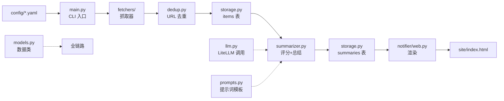

# src/ 源码目录说明

> 这是 ai-daily 的全部业务代码。整体是一条「抓取 → 评分 → 总结 → 渲染」的流水线，
> 由 CLI 三个子命令驱动，SQLite 是唯一持久层。



---

## 目录结构

```
src/
├── __init__.py           # 包标记（空）
├── config.py             # 配置加载与校验
├── models.py             # 数据类
├── dedup.py              # URL 去重
├── storage.py            # SQLite 读写
├── summarizer.py         # 评分 + 总结流水线
├── llm.py                # LiteLLM 封装
├── prompts.py            # 提示词模板加载/渲染
├── logging_setup.py      # 日志初始化
├── main.py               # CLI 入口（fetch/summarize/render）
├── fetchers/             # 抓取器（按 source.type 分派）
│   ├── __init__.py       # 注册表 + 编排
│   ├── arxiv.py          # arXiv API
│   ├── github.py         # GitHub 搜索 API
│   ├── hackernews.py     # HN Algolia API
│   ├── rss.py            # RSS/Atom
│   └── _http.py          # 共享常量（USER_AGENT）
└── notifier/             # 通知/展示
    ├── __init__.py       # 包标记（空）
    ├── labels.py         # 来源 → 友好名 + 分类
    └── web.py            # 渲染静态 HTML
```

---

## 分文件详解

### 入口与配置

**`main.py` — CLI 入口**
- `main(argv)`：argparse 分发三个子命令 `fetch` / `summarize` / `render`。
- `run_fetch()`：抓取全部源 → `dedup_by_url` 去重 → `record_items` 入库。
- `run_summarize_cmd()`：加载配置，调用 `run_summarize`。
- `run_render_cmd()`：加载配置，调用 `render_site` 渲染。
- 三个子命令共享 `--sources` / `--preferences` / `--db` 参数；`render` 额外有 `--output-dir` / `--within-days`。

**`config.py` — 配置加载与校验**
- `Config` / `Models` dataclass：配置的强类型容器（`subfields` 是 **Phase 1 新增**）。
- `load_config()`：读两个 YAML 并组装 `Config`。
- `_load_yaml()`：读文件、校验顶层是 mapping。
- `_validate_source()`：每个 source 必须有 `name` / `type`。
- `_parse_models()`：解析 `models.scorer` / `models.summarizer`。
- `_parse_bounded_int()`：解析整数并限制范围（如 `score_threshold` 0-10）。
- `_parse_subfields()`：**Phase 1 新增**，解析并校验 `subfields: [{key, label}]`（key 非空、不重复）。

### 数据模型与持久层

**`models.py` — 数据类**
- `Item`：抓取到的原始条目（url/title/content/published_at/source/raw）。
- `Score`：评分结果（score/tags/model/cost_usd/**field**）。`field` 是 **Phase 1 新增** 的 AI4S 子领域 key。
- `Summary`：总结结果（innovation/approach/metrics/links/why_relevant）。
- `Analysis`：`Item + Score + Summary` 的联表视图，供渲染用；带 `surfaced_at` 和 `total_cost_usd` 属性。

**`storage.py` — SQLite 读写（`Storage` 类）**
- `_SCHEMA`：建表 SQL——`items`（url 主键）+ `summaries`（url 主键、外键 items）。`summaries.field` 列是 **Phase 1 新增**。
- `init()`：建库 + 迁移（`_migrate_add_surfaced_at`、**_migrate_add_field**（Phase 1 新增））。
- items 相关：`seen_urls` / `record_items` / `get_items_by_urls` / `get_unscored_items`。
- summaries 相关：`save_score`（**Phase 1 增加 field 写入**）/ `save_summary`。
- 查询：`get_top_summaries` / `get_today_summaries`（今日上墙或未上墙）/ `get_archive_summaries`（之前几天上墙，按日期窗口）。
- `mark_surfaced()`：把今日条目标记为已上墙（NULL → 当前时间）。
- `_row_to_item` / `_row_to_analysis`：sqlite 行 → 数据类（`_row_to_analysis` **Phase 1 读回 field**）。

### 评分 / 总结 / LLM

**`summarizer.py` — ② 阶段流水线**
- `run_summarize()`：取 7 天内未评分条目 → 并发 `_score_one` 打分 → 过 `score_threshold` 的按分倒序取 `top_n` → 并发 `_summarize_one` 总结。
- `_render_score_prompt()`：**Phase 1 改签名 `(item, cfg)`**，注入关键词 + `fields`（subfield key 列表）。
- `_render_summary_prompt()`：**Phase 1 改签名 `(item, cfg)`**。
- `_score_one()`：**Phase 1 新增 field 解析**——校验模型返回的 `field` 是否在 `cfg.subfields` 里，越界回退 `""`。
- `_summarize_one()`：校验总结 JSON 必填字段。

**`llm.py` — LiteLLM 封装**
- `complete_json()`：调 LLM，返回 `(解析后的 dict, 累计成本)`；坏 JSON 自动重试一次（重试时追加「只输出 JSON」的提示）。
- `parse_json_loose()`：容错解析——剥 markdown 代码块围栏、修尾逗号，再 `json.loads`。
- `check_api_keys()`：按模型字符串的 provider 前缀反查环境变量（`_PROVIDER_ENV`），缺 key 报错。
- `_provider_of()` / `_PROVIDER_ENV`：provider 前缀 → 环境变量映射（含 `deepseek`）。

**`prompts.py` — 提示词模板**
- `load_prompt(name)`：从 `prompts/<name>.txt` 读模板。
- `render(template, values)`：`str.format` 填充占位符；JSON 示例里的 `{{ }}` 需写成转义形式。

### 抓取器 `fetchers/`

**`fetchers/__init__.py` — 注册表与编排**
- `_REGISTRY`：`{"rss": "fetch_rss", "arxiv": "fetch_arxiv", "github": "fetch_github", "hackernews": "fetch_hackernews"}`。
- `fetch_all(sources, window_hours)`：并发跑所有源。
- `_run_one()`：单个源 try/except，**失败只打日志返回空列表，不影响其它源**（核心设计）。

**`fetchers/arxiv.py`** — 查 arXiv API，`sortBy=submittedDate` 取最新，超时重试一次。

**`fetchers/github.py`** — 查 GitHub 搜索 API，按 `topic` + `min_stars` + `pushed_at` 时间窗口过滤。

**`fetchers/hackernews.py`** — 走 HN Algolia 接口，按 `query` + `min_points` 过滤。

**`fetchers/rss.py`** — 用 `feedparser` 解析 RSS/Atom，按时间窗口过滤条目。

**`fetchers/_http.py`** — 共享 `USER_AGENT` 常量。

### 通知 / 展示 `notifier/`

**`notifier/web.py` — 渲染静态站点**
- `render_site()`：取 `get_today_summaries` + `get_archive_summaries`，用 Jinja2 渲染 `index.html`，写完后 `mark_surfaced`。
- `_group_archive_by_date()`：把归档条目按 surfaced 日期分组、倒序。

**`notifier/labels.py` — 来源友好名 + 分类**
- `label_for(source)`：把 `rss:deepmind-blog` 映射成「DeepMind」+ 分类「lab」，前端据此配色。
- `SourceLabel` dataclass、`_REGISTRY`（**Phase 1 改成 AI4S 源**）、`_PREFIX_FALLBACK`（未知来源按前缀兜底）。

---

## 模块间依赖关系

- `main.py` → 几乎所有模块（入口）。
- `summarizer.py` → `llm.py`（调模型）、`prompts.py`（拼提示词）、`storage.py`（读写）、`models.py`。
- `fetchers/*` → `models.py`（产出 `Item`）、`_http.py`（共享常量）。
- `notifier/web.py` → `storage.py`、`notifier/labels.py`、`templates/*.j2`。
- `dedup.py` → `storage.py`、`models.py`。
- `config.py` / `models.py` / `logging_setup.py` 是底层，被多数模块依赖。

## Phase 1 改动标记（AI4S）

| 文件 | 改动 |
| --- | --- |
| `config.py` | `Config.subfields` + `_parse_subfields()` |
| `models.py` | `Score.field` 字段 |
| `storage.py` | `summaries` 表加 `field` 列、`_migrate_add_field()`、`save_score`/查询/`_row_to_analysis` 同步 |
| `summarizer.py` | `_score_one` 解析并校验 `field`；`_render_*_prompt` 改传 `cfg` 注入 `fields` |
| `notifier/labels.py` | `_REGISTRY` 换成 AI4S 来源 |

> 提示词（`prompts/*.txt`）和配置（`config/*.yaml`）不在 `src/`，但同样属于 Phase 1 改动，详见 `docs/stages/01-AI4S主线.md`。
